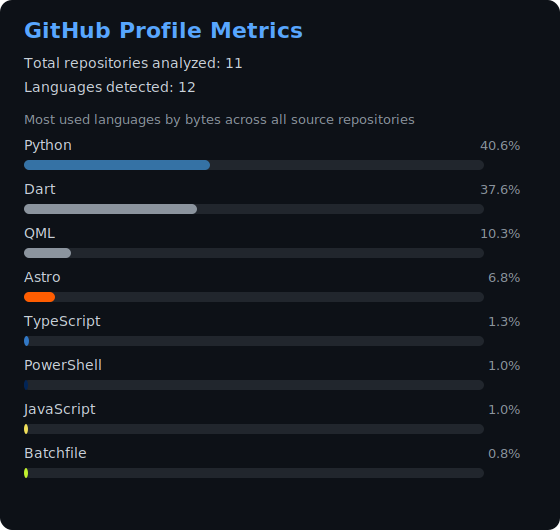

# Jordan Zavaleta

Geological Engineering | Applied Geophysics | GIS | Machine Learning

Geoscientist and researcher in training focused on geophysics, GIS, remote sensing, and reproducible geodata workflows. I build tools and experiments that connect field geology, spatial analysis, and computational methods for practical geological and mining applications.

## Focus Areas

- Applied geophysics and geological interpretation
- GIS and geospatial automation
- Remote sensing and Earth observation
- Geological data processing and curation
- Python tooling for geoscience workflows
- Machine learning applied to geospatial and geological data

## Tech Stack

## Main Languages and Tools

Python, QGIS, GDAL, Google Earth Engine, Git, geospatial data processing, remote sensing workflows, and machine learning applied to geological data.

## Featured Projects

- [GeoNormPy](https://github.com/jordan-zav/GeoNormPy): Python tools for geoscience-oriented data processing.
- [QGIS-RRIM](https://github.com/jordan-zav/QGIS-RRIM): GIS workflow work around raster and terrain-style processing in QGIS.
- [PyTAB2GIS](https://github.com/jordan-zav/PyTAB2GIS): Utilities to move tabular data into GIS-friendly workflows.
- [Atlas Interactivo de Depósitos Minerales del Perú](https://github.com/jordan-zav/Atlas-Interactivo-de-Depositos-Minerales-del-Peru): Interactive mapping-oriented repository for Peruvian mineral deposits.
- [gee-satellite-downloader](https://github.com/jordan-zav/gee-satellite-downloader): Earth observation data download tooling.
- [GeoRefMaps](https://github.com/jordan-zav/GeoRefMaps): Georeferenced map workflow experiments.

## Current Direction

- Building reproducible geoscience tooling
- Expanding GIS, geophysics, and remote sensing workflows
- Developing practical computational tools for geological and mining applications
- Sharing open repositories that support geoscience learning and experimentation
