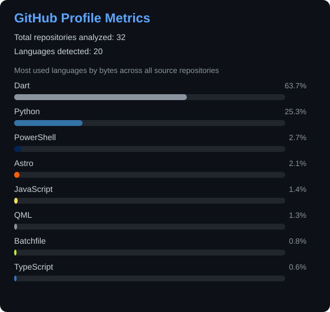

# 🚀 Actualizador de Métricas del Perfil

## Configuración Inicial

### 1. Establecer el Token de GitHub (Recomendado)

Sin token, el generador analiza únicamente repositorios públicos. Para incluir repositorios privados y evitar límites bajos de la API, configura un token:

**Windows PowerShell:**
```powershell
[Environment]::SetEnvironmentVariable("GITHUB_TOKEN", "tu_token_aqui", "User")
```

**Windows CMD:**
```cmd
setx GITHUB_TOKEN "tu_token_aqui"
```

Para obtener tu token:
1. Ve a https://github.com/settings/tokens
2. Para un token clásico que deba leer repositorios privados, habilita `repo`. Si solo necesitas repositorios públicos, no configures ningún token.
3. Cópialo y úsalo en el comando anterior

## Uso

### Opción 1: Doble clic (Más fácil)
```
✓ Solo haz doble clic en: update-metrics.bat
```

### Opción 2: Terminal (Con más control)
```powershell
.\update-metrics.bat
```

## Automatización (Windows Task Scheduler)

El script de automatización configurará una tarea programada con dos desencadenadores:
1. **Diariamente** a las 09:00 AM.
2. **Al iniciar sesión (logon)** cada vez que enciendas tu computadora.

### Configuración automática (Recomendada)
Para registrar la tarea automáticamente:
1. Haz clic derecho sobre `setup-automation.bat` (o ejecuta `setup-automation.vbs`) y selecciona **Ejecutar como administrador**.
2. ¡Listo! La tarea quedará registrada con ambos desencadenadores.

### Configuración manual (Alternativa)
Si prefieres hacerlo manualmente:
1. Abre el **Programador de tareas** (busca "Task Scheduler").
2. Clic derecho → **Crear tarea básica...**
3. Nombre: `Update GitHub Profile Metrics`
4. Desencadenador: Selecciona **Al iniciar el equipo** (o **Al iniciar sesión**) y/o **Diariamente**.
5. Acción: Iniciar un programa → Selecciona `update-metrics.bat`.
6. Asegúrate de configurar la carpeta del repositorio como directorio de inicio en las propiedades de la acción.

## Qué hace el script

- ✓ Obtiene todos tus repositorios públicos y privados
- ✓ Analiza los lenguajes de programación usados
- ✓ Genera un SVG con las estadísticas
- ✓ Actualiza el archivo `metrics.svg`
- ✓ Hace commit y push automáticamente

## Resultado

El archivo `metrics.svg` se actualiza automáticamente y puedes agregarlo a tu README de perfil:

```markdown

```

---

**Nota:** Asegúrate de tener configurado Git correctamente y acceso de push al repositorio.
